# ProtStat
Calculations of basic statistics (avg protein length and aminoacid content) from a proteome dataset (from UniProt)
- from selected organisms (Arabidopsis thaliana, Bacillus subtilis, Caenorhabditidis elegans, Danio rerio, Drosophila melanogaster, Escherichia coli, Mus musculus, Saccharomyces cerevisiae)
- from randomly selected 100 samples from different domains (Eukaryota, Bacteria, Archaea, Viruses)

### Required modules
-requests
-matplotlib
-pandas
-prettytable

### Scripts
- *download_extract_selected_organisms.py*: download and extract proteomes from 8 organisms
- *download_domain_samples.py*: download 100 proteome samples from 4 domains
- *extract_domain_samples.py*: extract downloaded samples
- *join_samples.py*: for each domain join every .fasta file from 100 samples into one big file 
- *selected_organisms_statistics.py / domains_statistics.py*: calculate aminoacid content and average protein lengths from selected organisms / between domains ; make tables and plots
- *funcs.py*: functions for calculating statistics

### Order
-**Selected ogranisms** 

*download_extract_selected_organisms.py* -> *selected_organisms_statistics.py*

-**Domains** 

*download_domain_samples.py* -> *extract_domain_samples.py* -> *join_samples.py* -> *domains_statistics.py*

# Results

### Selected ogranisms

**Tables**

[Aminoacid content table](tables/selected_organisms_aa_cont.txt)

[Average protein length table](tables/selected_organisms_avg_prot_len.txt)

**Plots**

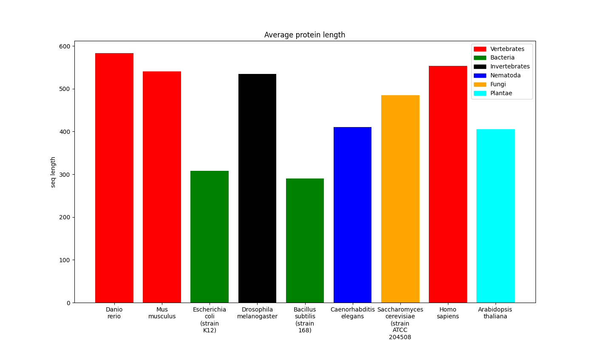
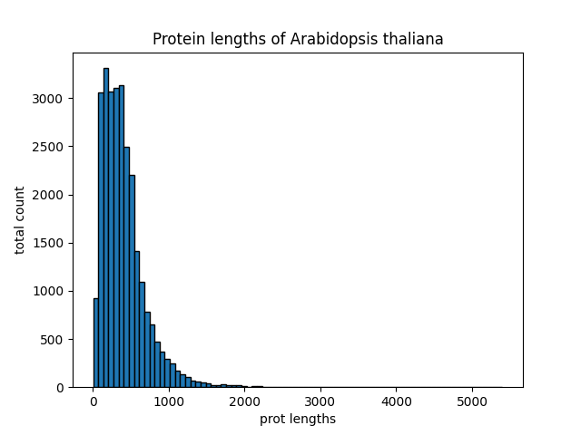
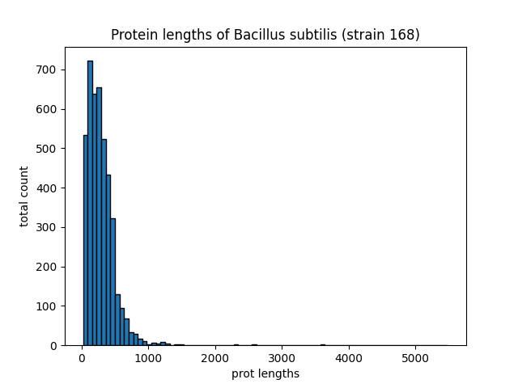
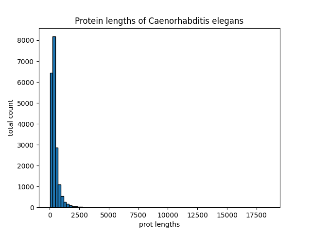
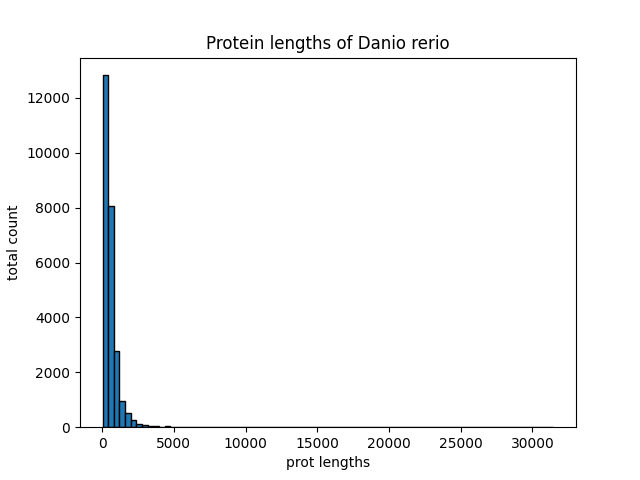
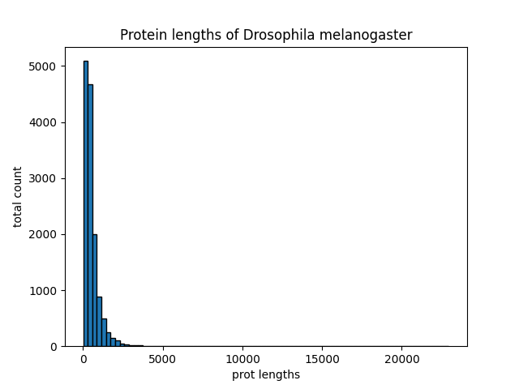
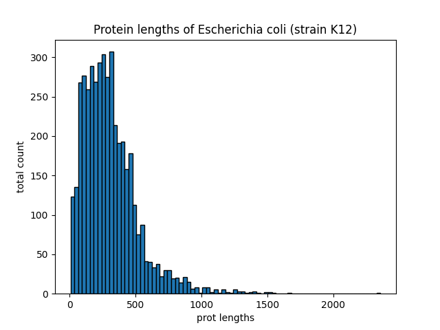
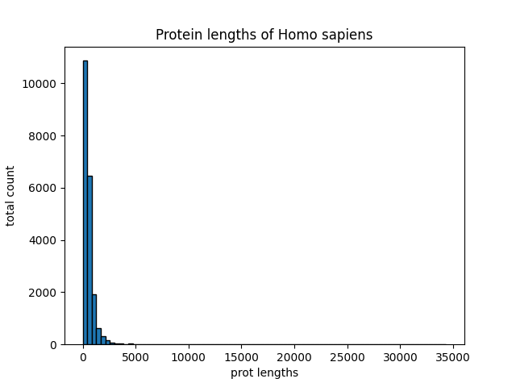
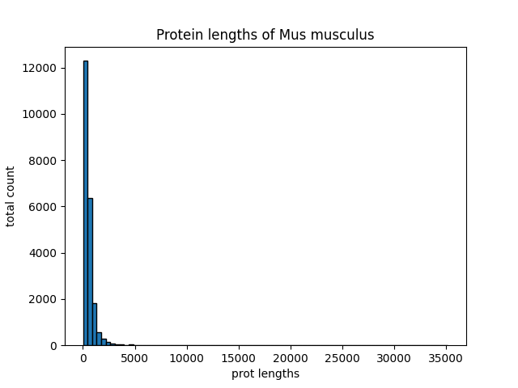
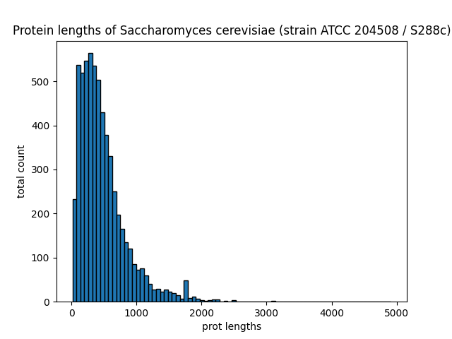

### Domains

**Tables**

[Aminoacid content table](tables/domains_aa_cont.txt)

[Average protein length table](tables/domains_avg_prot_len.txt)

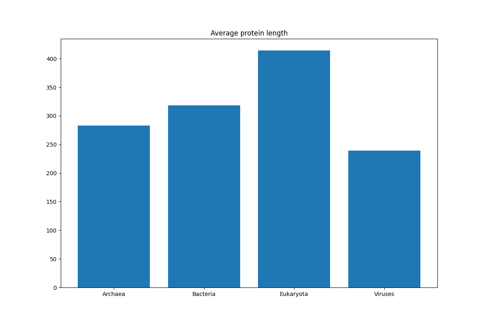
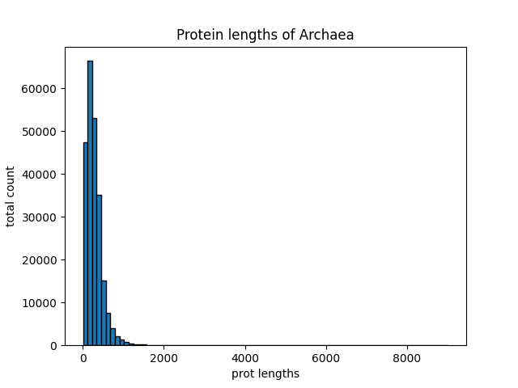
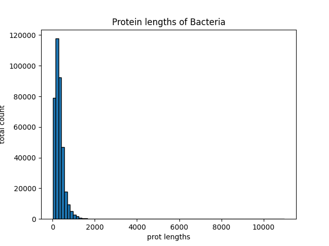
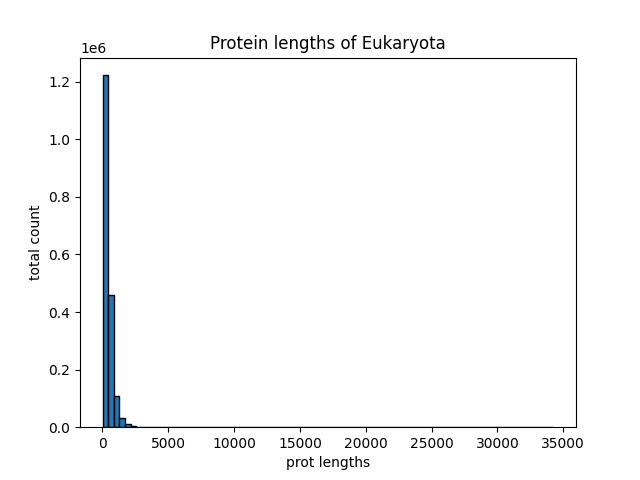
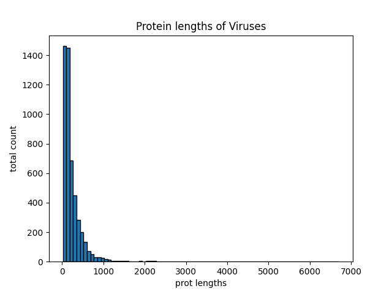

